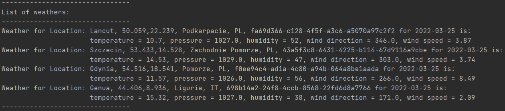

# WeatherService – weather app
Simple weather app created with Java, Hibernate and PostgreSQL.

## Table of Contents
* [General Info](#general-information)
* [Features](#features)
* [Usage](#usage)
* [Room for Improvement](#room-for-improvement)
* [Contact](#contact)

## General Information
The application consists of two main parts:
* Location
  * Coordinates
  * City name
  * Region name
  * Country name
  * Location ID
* Weather
  * Temperature
  * Pressure
  * Humidity
  * Wind direction
  * Wind speed

Main usage of this application is:
* Creating a list of locations for which you are able to check weather.
* Checking weather for locations from list.

## Features
- Downloading live weather forecast from OpenWeather API
- Storing data in PostgreSQL
- Choosing location based on both city name and coordinates (in case there are couple locations with same name)

## Usage
Main menu layout:

 
1. Adding new location
This function adds entered location to DB. To add new location you have to enter location’s coordinates, city name, region name (optional) and country name.

2. Displaying available locations
This function displays all locations present in DB.

3. Downloading weather
This function downloads and displays weather. After choosing this option you can decide whether you want to check weather for all locations from list or maybe just one (both existent and nonexistent on list).

Then you have to enter which day you want to check the weather for. It can be maximum of one week forward.

Then if you have chosen weather for specific location, you have to enter location details as like as whilst adding new location.
Then the weather is added to DB and appeared on screen (screenshot below shows option for all locations).

4. Displaying information about location
This function displays details about specific location. To define which location you want to check you can enter city name or location ID.

5. Editing location
This function edits existing location. You can edit city name, region name, country name or coordinates. When you choose option you have to enter city name or ID of location you want to edit.

Then you can enter new value (in this case region name).

After entering valid new name the values in DB is updated and you receive notification.

6. Clearing location
This function clears existing location. After choosing this option you can decide whether you want to clear all locations from list or maybe just one.

Then if you have chosen one location, you have to enter city name or ID of location you want to delete.
Then the location is deleted and you receive notification.

7. Exit
This option closes application. Note that before shutting down application DB is clears from existing locations and weathers.

## Room for Improvement
Room for improvement:
- Replace similar methods (responsible for exchanging data with DB) to generic methods

To do:
- Add more weather providers/services and count average of input data

## Contact
Created by Karol Wielopolski and Kamil Musiał - feel free to contact us!
